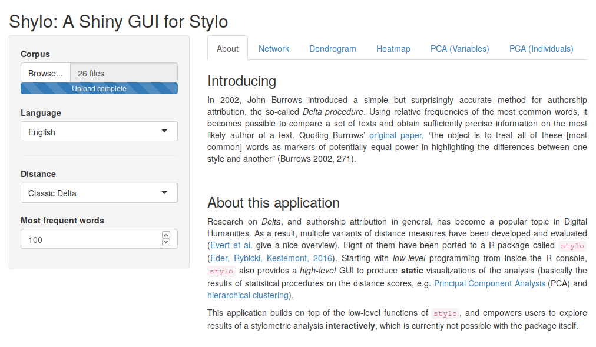

# Shylo: A Shiny GUI for Stylo

This application builds on top of the R package [`stylo`](https://github.com/computationalstylistics/stylo), and provides interactive visualizations of the output of the distance matrix produced by `stylo`.



## Requirements

To install the requirements, copy + paste the following lines into an R environment:

```
install.packages("shiny")
install.packages("stylo")
install.packages("explor")
install.packages("scatterD3")
install.packages("ggiraph")
install.packages("networkD3")
```
## Getting Started

To start the application, run the file `app.R` in the R environment or use the following line in a command-line:

```
Rscript app.R
```
