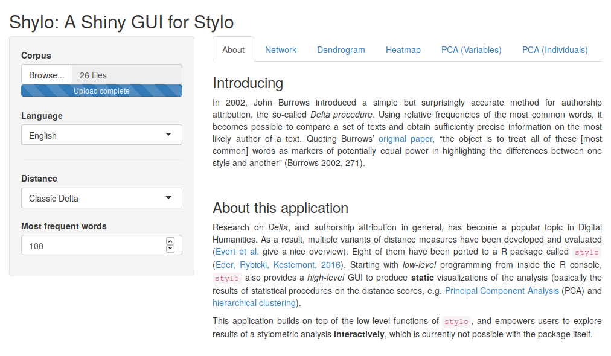

# A Shiny GUI for Stylo

This application builds on top of the R package [`stylo`](https://github.com/computationalstylistics/stylo), and provides interactive visualizations of stylometric analyses.



> You can access Shylo without installation right from your browser following [this link](https://severinsimmler.shinyapps.io/shylo/).

## Requirements
To install the requirements, copy + paste the following lines into an R environment:

```
install.packages("shiny")
install.packages("stylo")
install.packages("explor")
install.packages("scatterD3")
install.packages("ggiraph")
install.packages("networkD3")
```

## Getting Started
To start the application, `cd` to the folder `app` and run the file `shylo.R`:

```
$ Rscript shylo.R
```
